  

 

I build machines that learn. They often learn the wrong thing, so I also fix machines that learn.

**Now**

- **Vocare Speech** — I build the tools that judge whether speech ML models are any good: annotation platforms, evaluation pipelines, scoring systems. The models get all the credit. The pipelines do all the work.
- **University of Adelaide (Honours thesis)** — I blow up satellites. In simulation — real ones are expensive. I render the breakup in Blender, then use event cameras, which don't capture frames, only changes, to track the debris. Fast objects that blur into smudges on a normal camera show up clearly as streams of change. My job is following those streams.

**Before**

- **Budi** — Cloud backend engineer. TypeScript, AWS, serverless. The cloud is just someone else's computer, but at least it's not my computer when it breaks.
- **GoMicro** — Taught a model to look at seeds and predict when they'd sprout. The seeds were slow. The model was not.
- **Vietnam National Informatics Olympiad** — solved puzzles faster than 95% of the country. Got a certificate. You cannot eat a certificate.

**Tools**

`Python` `PyTorch` `OpenCV` `TypeScript` `React` `Go` `AWS` `Docker` `Blender`

**Off the clock**

I film cooking videos for an audience of dozens. Dozens! Production is overseen by three cats — Biscoff, Ori, and Sol — who walk on the keyboard, reject every commit, contribute nothing, and stay anyway.

---

  <a href="https://unglinh.dev/">unglinh.dev</a> &nbsp;·&nbsp; <a href="https://linkedin.com/in/linh-tuan-ung">LinkedIn</a> &nbsp;·&nbsp; <a href="https://codeforces.com/profile/unglinh">Codeforces</a>

